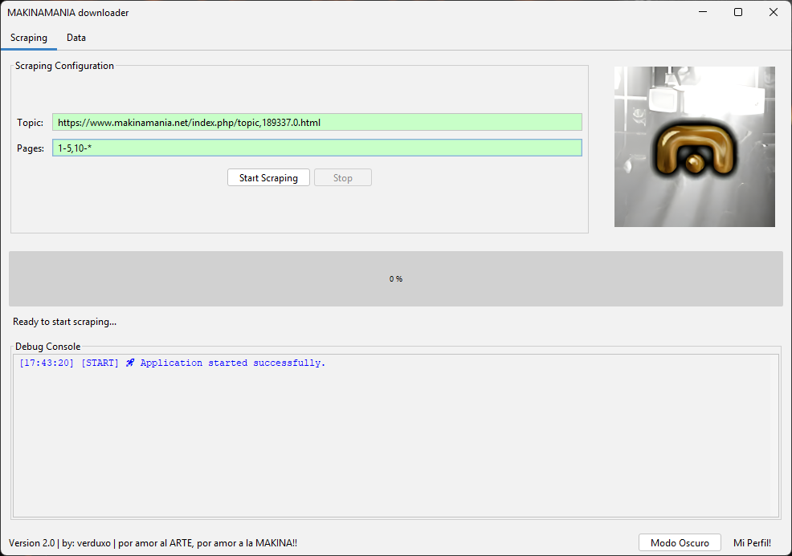
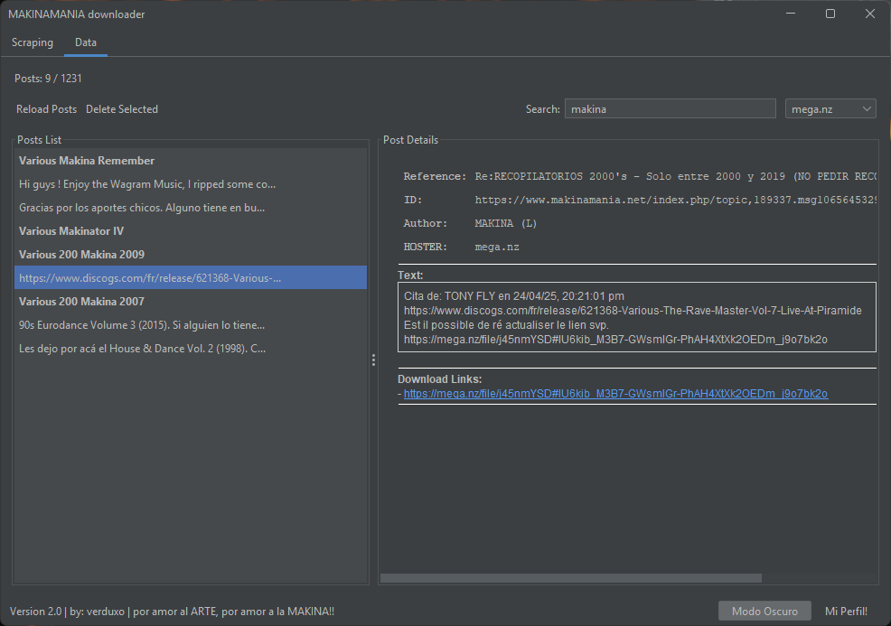

# MakinaMania Downloader

**Herramienta de scraping, filtrado y gestión de posts del foro [MAKINAMANIA.NET]("makinamania.net")**

>esta documentación se hizo pensando en enteder la herramienta de forma completa, no solo funcionalidad si no código, estructura y decisiones, si no te interesa, aquí tienes el apartado que te enseña todo lo que necesitas saber para ponerla en marcha si eres novato
>[Instalación y Ejecución](#9-instalación-y-ejecución)


## 1. Visión General del Proyecto

### Contexto y Propósito

Este proyecto resuelve un problema personal concreto: **la dificultad para centralizar, organizar y validar enlaces de descarga de los posts del foro MAKINAMANIA**. Foros como MakinaMania contienen miles de publicaciones con enlaces de descarga a contenido musical, pero estos enlaces suelen

- Estár totalmente dispersos
- Incluyen duplicados 
- Pierden validez con el tiempo (links caídos)
- Carecen de metadata estructurada (artista, álbum, año)

### Problema real que resuelve

En foros musicales clásicos como **makinamania** existe una enorme cantidad de contenido compartido de gran valor histórico pero su distribución anárquica lo hace muy difícil de preservar y consultar.

Esta aplicación nace con el objetivo de **automatizar el análisis de hilos del foro** y extraer de forma inteligente los enlaces musicales publicados en los posts, transformando información caótica en una **colección estructurada y utilizable**.

El sistema funciona como un **scraper especializado en foros**, capaz de:

- Analizar un tópico completo siguiendo su patrón de paginación  
- Detectar y filtrar enlaces relevantes dentro de los mensajes  
- Evitar duplicados, enlaces caídos y contenido innecesario  
- Verificar la disponibilidad real de los enlaces antes de almacenarlos  
- Enriquecer la información obtenida mediante metadatos externos (Discogs)  
- Organizar el resultado en colecciones consultables, filtrables y exportables en formato JSON  

Actualmente el proyecto está enfocado exclusivamente en **makinamania**. No obstante, su diseño permite ampliarlo fácilmente a otros foros similares en futuras actualizaciones.

El objetivo final es **preservar y estructurar el conocimiento musical compartido en comunidades online**, facilitando su acceso y evitando que años de aportes se pierdan con el paso del tiempo.


### Casos de Uso

-podria hacer una lista diciendote que si eres un empresario esta información bla bla bla, pero esto es un proyecto PERSONAL, el usuario final para el que fue pensado es para mi y para los de mi especie. SI TE ENCANTA EL MAKINA, si la música electronica no es solo ruido, si de verdad sientes lo que siento cuando la escucho, entonces este programa te permitira acercarte más a ella. que digo acercarte, te brindará una coleccion casi ARCANA de TEMAZOS y discos olvidados por la masa pero no por nosotros!.


## 2. Arquitectura General del Sistema

### Visión de Alto Nivel

El sistema sigue una arquitectura **modular en capas** con separación clara de responsabilidades:

```
┌─────────────────────────────────────────────────────────┐
│                    UI Layer (Swing)                     │
│  ┌──────────────────┐      ┌──────────────────┐         │
│  │  ScrapingPanel   │      │    DataPanel     │         │
│  └──────────────────┘      └──────────────────┘         │
└─────────────────────────────────────────────────────────┘
                          ↓
┌─────────────────────────────────────────────────────────┐
│                 Business Logic Layer                    │
│  ┌──────────────┐  ┌──────────┐  ┌──────────────────┐   │
│  │ PostManager  │  │ Scraper  │  │  Checker         │   │
│  │ (State)      │  │ (Extract)│  │  (Validation)    │   │
│  └──────────────┘  └──────────┘  └──────────────────┘   │
└─────────────────────────────────────────────────────────┘
                          ↓
┌─────────────────────────────────────────────────────────┐
│                 Persistence Layer                       │
│  ┌──────────────┐           ┌──────────────────┐        │
│  │  JsonUtils   │◄─────────►│  posts.json      │        │
│  │              │           │  scanned.json    │        │
│  └──────────────┘           └──────────────────┘        │
└─────────────────────────────────────────────────────────┘
                          ↓
┌─────────────────────────────────────────────────────────┐
│              External Services Layer                    │
│  ┌──────────────┐           ┌──────────────────┐        │
│  │ Jsoup (HTTP) │           │ Discogs API      │        │
│  │ MakinaMania  │           │ (Metadata)       │        │
│  └──────────────┘           └──────────────────┘        │
└─────────────────────────────────────────────────────────┘
```

### Componentes Principales

#### 1. **UI Layer (makinamania.ui)**
- **Responsabilidad**: Interacción con el usuario.
- **Componentes**:
  - `ScrapingPanel`:panel de onfiguración y ejecución de scraping
 

    
  - `DataPanel`:panel de visualización, búsqueda y gestión de posts
- **Comunicación**: Se comunica con `PostManager` para actualizar y gestionar la lista de `posts.json`




  

#### 2. **Business Logic Layer**
- **`PostManager`**: Gestiona el estado global de posts, filtrado, búsqueda y operaciones CRUD
- **`MakinamaniaScraper`**: Extrae datos estructurados desde HTML mediante Jsoup
- **`Checker`**: Valida enlaces mediante HEAD requests y APIs específicas de hosters (adios a los enlaces de mega caidos :D)
- **`ahora en MakinamaniaScraper antes foroUtils`**: Genera URLs de paginación basadas en patrones de entrada (esta es la parte que nos permitirá en un futuro expandir esta herramienta a más foros)

#### 3. **Persistence Layer**
- **`JsonUtils`**: Serialización/deserialización con Jackson
- **Archivos JSON**:
  - `posts.json`: Almacenamiento estructurado de posts extraídos
  - `scanned.json`: Registro de URLs ya procesadas (evita reprocesamiento)

#### 4. **External Services**
- **Jsoup**: Parsing robusto de HTML malformado (tolerancia a errores del DOM)
- **Discogs**: Enriquecimiento opcional de metadata de álbumes

### Decisiones de Diseño Clave

1. **Persistencia local en JSON** en lugar de base de datos relacional:
   - Simplicidad de despliegue (sin servidor DB)
   - Portabilidad del dataset completo
   - Inspección manual trivial del contenido

2. **Validación asíncrona de enlaces**:
   - Evita bloquear la UI durante verificaciones HTTP
   - Uso de `ExecutorService` con pool de 3 threads para no estar todo el día.

3. **Caché de Discogs**:
   - Reduce llamadas HTTP repetidas
   - evita bloqueos de peticiones por abuso.
   - Mejora tiempos de respuesta en scraping de URLs ya visitadas

4. **Separación UI/Lógica**:
   - Facilita testing unitario de scraping sin GUI
   - Permite futuras interfaces CLI o REST API sin modificar lógica

---

## 3. Flujo de Ejecución (Narrado)

### Fase 1: Inicialización
1. **Arranque de aplicación** (`MainApp.main()`)
   - Inicializa Look & Feel (FlatLaf)
   - Crea `PostManager` con modelo de datos compartido
   - Inicializa paneles de UI (`ScrapingPanel`, `DataPanel`)

2. **Carga de estado persistente**
   - `JsonUtils.loadScannedUrls()`: Lee URLs ya procesadas desde `scanned.json`
   - `JsonUtils.loadPosts()`: Carga posts existentes en `posts.json` (si el usuario presiona "Reload") ( reload = load )

### Fase 2: Configuración de Scraping
1. **Usuario introduce URL base del hilo** (ej: `https://www.makinamania.net/index.php/topic,189337.0.html`)
2. **Usuario especifica páginas a scrapear** (ej: `1-5,10,15-*`)
3. **Validación en tiempo real**:
   - `UrlValidationListener`: Verifica formato de URL con regex
   - `PagesValidationListener`: Valida sintaxis de rangos de páginas

### Fase 3: Generación de URLs
1. **`MakinamaniaScraper.genUrls()`**:
   - Parsea el patrón de entrada (ej: `1-5,10-*`)
   - Detecta el número total de páginas del hilo (`getTotalPages()`)
   - Genera URLs individuales con offset correcto (ej: `.0.html`, `.15.html`, `.30.html`)

2. **Filtrado de URLs ya procesadas**:
   - `JsonUtils.filterNewUrls()`: Compara con `scannedUrls` cargadas
   - Solo URLs nuevas pasan a scraping (si borraste un post y lo quieres de vuelta necesitarás saber en que página estaba)

### Fase 4: Scraping Concurrente
1. **`ScrapingWorker`** (SwingWorker) ejecuta en background:
   - Crea `ExecutorService` con pool de 3 threads
   - Por cada URL nueva:
     - **Thread N** ejecuta `Scraper.scrapePosts(url)`
     - Parsea HTML con Jsoup
     - Extrae elementos `<div class="post">`
     - Por cada post:
       - Extrae ID, autor, referencia, enlaces de descarga, imágenes
       - Identifica hoster predominante (`extractHoster()`)
       - Valida al menos un enlace activo (`Checker.checkLink()`)
       - Si tiene enlaces activos: crea objeto `Post`
       - Si tiene enlaces Discogs: extrae títulos de álbumes

2. **Validación de enlaces**:
   - **Mega.nz**: Petición POST a API interna con payload JSON
   - **TeraBox/Mediafire/Rapidgator**: HEAD request HTTP
   - **Drive/Dropbox/SwissTransfer**: Asumidos válidos (no hay API pública)

3. **Enriquecimiento de Discogs**:
   - Por cada enlace Discogs detectado:
     - Intenta extraer título desde URL (ej: `release/123456-Artist-Album`)
     - Si falla, hace scraping de la página Discogs con delay de 500ms
     - Resultado cacheado en `DISCOGS_CACHE` (ConcurrentHashMap)

### Fase 5: Persistencia
1. **Finalización de scraping**:
   - Elimina duplicados mediante `Set<Post>` (igualdad por ID)
   - `JsonUtils.toJson()`: Merge con posts existentes en `posts.json`
   - `JsonUtils.saveScannedUrls()`: Actualiza `scanned.json`

2. **Actualización de UI**:
   - `PostManager.updatePosts()`: Refresca modelo de datos
   - Cambia automáticamente al tab "Data"

### Fase 6: Gestión de Datos
1. **Búsqueda y filtrado**:
   - Usuario escribe en campo de búsqueda → `SearchDocumentListener` activa filtrado
   - Selecciona hoster → `PostManager.filterPostsByHoster()`
   - Filtros aplicados sobre `allPosts` en memoria

2. **Visualización de detalles**:
   - Selección de post en lista → `showPostDetails()`
   - Renderizado HTML en `JEditorPane`
   - Hyperlinks clickables para abrir en navegador

3. **Eliminación**:
   - Usuario selecciona posts → "Delete Selected"
   - Confirmación de diálogo
   - `PostManager.deleteSelectedPosts()` → actualiza memoria y `posts.json`

---

<br>
<br>
<details>
<summary>4. Componentes Clave [PROFUNDIZANDO EN LA EXPLICACIÓN ANTERIOR]</summary>


### 4.1 Scraper

**Ubicación**: `makinamani.MakinamaniaScraper`

**Responsabilidad**: Extracción y transformación de datos HTML a objetos estructurados.

**Entradas**:
- URL de página del foro (ej: `https://www.makinamania.net/index.php/topic,189337.0.html`)

**Salidas**:
- `List<Post>`: Colección de posts con enlaces válidos

**Métodos clave**:
- `scrapePosts(String url)`: Punto de entrada principal
- `parsePost(Element post)`: Transforma elemento DOM en objeto `Post`
- `extractDownloadLinks(Element post)`: Filtra enlaces según hosters conocidos
- `extractDiscogsLinks(Element post)`: Detecta enlaces de Discogs
- `extractHoster(List<String>)`: Identifica hoster predominante mediante conteo
- `extractAlbumTitles(List<String>)`: Enriquece con metadata de Discogs

**Suposiciones del sistema**:
- El HTML del foro tiene estructura predecible (`<div class="post">`)
- Los atributos `id` de posts siguen formato `subject_{id}`
- Hosters reconocidos están en lista predefinida (`HOSTERS`)

**Tolerancia a errores**:
- Jsoup maneja HTML malformado sin fallos
- `selectFirst()` retorna `null` sin excepción → métodos `extractText()` manejan nulls
- Timeouts de 10 segundos en todas las conexiones HTTP

---

### 4.2 Sistema de Filtrado (PostManager)

**Ubicación**: `makinamania.PostManager`

**Responsabilidad**: Gestión centralizada del estado de posts, deduplicación y filtrado.

**Estado mantenido**:
- `allPosts`: Lista completa de posts en memoria
- `existingIds`: Set de IDs para detección rápida de duplicados
- `listModel`: Modelo de datos de la UI (sincronizado)

**Operaciones principales**:
- `updatePosts()`: Reemplaza el conjunto completo de posts
- `addNewPosts()`: Merge incremental con deduplicación
- `applyCurrentFilter()`: Aplica búsqueda y filtros activos
- `filterPostsByHoster()`: Filtra por hoster específico
- `deleteSelectedPosts()`: Elimina de memoria y persiste cambios

**Estrategia de filtrado**:
1. Filtrado en memoria sobre `allPosts`
2. Uso de Streams API para composición de filtros
3. Búsqueda multi-campo (autor, referencia, álbum, enlaces)
4. Actualización reactiva de UI mediante `SwingUtilities.invokeLater()`

**Thread-safety**:
- Operaciones de UI ejecutadas en EDT (Event Dispatch Thread)
- Set de IDs thread-safe mediante `HashSet` protegido por métodos sincronizados

---

### 4.3 Enriquecimiento de Datos (Discogs)

**Ubicación**: `makinamania.Scraper.extractAlbumTitles()`

**Proceso**:
1. Por cada URL de Discogs:
   - Verificar cache `DISCOGS_CACHE` (ConcurrentHashMap)
   - Si no existe, intentar extracción desde URL (formato: `release/123456-Artist-Album`)
   - Si falla, scraping de página con Jsoup
   - Parseo de elemento `<h1 class="MuiTypography-headLineXL title_Brnd1">`
   - Split por `–` para separar artista de título
   - Almacenar en cache

2. **Rate limiting**:
   - Sleep de 500ms entre peticiones
   - User-Agent personalizado: `Mozilla/5.0`
   - Timeout de 10 segundos

**Decisiones de diseño**:
- Cache en memoria (no persistido) para simplicidad
- Prioridad a extracción desde URL (0 latencia) sobre scraping
- Tolerancia a fallos: enlaces Discogs opcionales, no bloquean scraping

---

### 4.4 Capa de Persistencia (JsonUtils)

**Ubicación**: `makinamania.JsonUtils`

**Responsabilidad**: Serialización thread-safe de datos a JSON.

**Archivos gestionados**:
- `resources/posts.json`: Base de datos de posts
- `resources/scanned.json`: Registro de URLs procesadas

**Estrategia de sincronización**:
- Locks separados (`POSTS_LOCK`, `URLS_LOCK`) para reducir contención
- Operaciones atómicas de lectura/escritura
- Merge automático en `toJson()`: carga existentes + añade nuevos + guarda

**Manejo de errores**:
- Archivos faltantes → retorna lista vacía sin error
- Errores de escritura → log de error en consola
- Deserialización corrupta → excepción propagada al llamador

**Optimizaciones**:
- ObjectMapper compartido (instancia singleton)
- TypeReference reutilizados para evitar instanciaciones
- Uso de `LinkedHashSet` para mantener orden de inserción y eliminar duplicados

---

### 4.5 Gestión de Estado (Post)

**Ubicación**: `makinamania.Post`

**Campos principales**:
```java
String id;                  // URL única del post (clave primaria)
String reference;           // Título del hilo
String author;              // Usuario que publicó
String text;                // Contenido completo del post
List<String> quotes;        // URLs de quotes a otros posts
List<String> downloadLinks; // Enlaces de descarga extraídos
List<String> discogs;       // Enlaces a Discogs
List<String> images;        // URLs de imágenes (excluyendo smileys)
List<String> albumTitles;   // Títulos enriquecidos desde Discogs
String hoster;              // Hoster predominante
boolean linkAlive;          // Indica si al menos un enlace está activo
```

**Igualdad y duplicados**:
- Implementa `equals()` y `hashCode()` basados en `id`
- Permite uso en `Set<Post>` para deduplicación automática

**Normalización de ID**:
- Elimina parámetros `PHPSESSID` de URLs mediante regex
- Garantiza unicidad independiente de sesiones de usuario

---

## 5. Gestión de Errores y Robustez

### 5.1 Errores de Red

**Problema**: Conexiones HTTP inestables, timeouts, servidores caídos.

**Estrategia**:
1. **Timeouts agresivos**:
   - Jsoup: 10 segundos en `Jsoup.connect().timeout(10000)`
   - HttpClient: 10 segundos en `HttpClient.newBuilder().connectTimeout()`

2. **Fallos controlados**:
   - `Scraper.scrapePosts()` retorna lista vacía en caso de excepción
   - `Checker.checkLink()` retorna `false` sin propagar excepción
   - Logs de error mediante `ConsoleLogger.error()` sin detener proceso

3. **Reintentabilidad**:
   - URLs fallidas permanecen en `scanned.json` solo si scraping completa
   - Usuario puede reintentar scraping de mismas páginas manualmente

### 5.2 Datos Incompletos o Malformados

**Problema**: Posts sin enlaces, HTML inesperado, campos faltantes.

**Estrategia**:
1. **Validación defensiva**:
   - Métodos `extractText()` manejan `null` retornando cadenas vacías
   - Verificación `downloadLinks.isEmpty()` antes de crear `Post`
   - Posts sin enlaces válidos descartados silenciosamente

2. **Tolerancia a HTML malformado**:
   - Jsoup parsea HTML como navegadores reales (tolerancia a errores)
   - Selectores CSS robustos con `selectFirst()` que retorna `null` sin error

3. **Metadata opcional**:
   - Campos `albumTitles` y `discogs` no requeridos
   - Fallos en scraping de Discogs no bloquean creación de `Post`

### 5.3 Corrupción de Datos

**Problema**: Archivos JSON parcialmente escritos, concurrencia en escritura.

**Estrategia**:
1. **Locks de sincronización**:
   - `POSTS_LOCK` y `URLS_LOCK` separados previenen race conditions
   - Operaciones de merge (leer + escribir) atómicas

2. **Validación en lectura**:
   - `loadPosts()` lanza `IOException` si JSON corrupto
   - Aplicación maneja error mostrando diálogo al usuario

3. **Backups implícitos**:
   - `toJson()` hace merge, no sobrescribe completo
   - Posts existentes preservados incluso si scraping parcial

### 5.4 Estados Intermedios

**Problema**: Aplicación cerrada durante scraping, proceso cancelado.

**Estrategia**:
1. **Persistencia incremental**:
   - `scanned.json` actualizado solo en `done()` de `SwingWorker`
   - Si proceso cancelado, URLs no marcadas como procesadas
   - Siguiente ejecución reintenta URLs pendientes

2. **Bandera de cancelación**:
   - `Scraper.stopRequested` verificada en loops críticos
   - `SwingWorker.cancel()` detiene threads de forma coordinada

3. **Parcial es válido**:
   - Posts extraídos antes de cancelación guardados en `posts.json`
   - Usuario puede continuar scraping desde donde quedó

---

## 6. Prevención de Duplicados y Consistencia

### 6.1 Detección de Duplicados

**Mecanismo principal**: Comparación de IDs normalizados de posts.

**Proceso**:
1. **Extracción de ID único**:
   - ID extraído de atributo `href` del enlace del título del post
   - Formato: `https://www.makinamania.net/index.php?action=printpage;topic=189337.msg3927802#msg3927802`

2. **Normalización**:
   - Eliminación de parámetros `PHPSESSID` mediante regex
   - Garantiza que mismo post con diferentes sesiones tenga mismo ID

3. **Deduplicación en múltiples niveles**:
   - **Nivel 1 (Memoria)**: `Set<String> existingIds` en `PostManager`
   - **Nivel 2 (Colección)**: `Set<Post>` antes de persistir (usa `equals()` basado en ID)
   - **Nivel 3 (Persistencia)**: Merge con posts existentes en `JsonUtils.toJson()`

### 6.2 Ventajas del Enfoque Elegido

**Por qué ID basado en URL del post**:
1. **Unicidad garantizada**: URLs de posts son únicas por diseño del foro
2. **Persistencia estable**: ID no cambia con ediciones del post
3. **Sin dependencia de contenido**: Cambios en texto no invalidan ID

**Comparado con alternativas**:
- **Hash de contenido**: Vulnerable a ediciones menores (espacios, formato)
- **Timestamp**: No garantiza unicidad (múltiples posts simultáneos)
- **Número secuencial local**: Frágil ante múltiples ejecuciones

### 6.3 Inconvenientes y Trade-offs

**Limitación**: Si la URL del post cambia en el foro (migración de plataforma), se detectaría como post nuevo.

**Mitigación**: URLs de foros establecidos raramente cambian. En caso de migración:
- Mantener archivo `posts.json` antiguo como backup
- Script de reconciliación por contenido (manual, fuera de scope)

**Escalabilidad**: Búsqueda en `HashSet` es O(1), eficiente incluso con 100k+ posts.

---

</details>
<br>
<br>

## 7. Decisiones Tecnológicas

### 7.1 Java 17 (LTS)

**Razones**:
1. **Long-Term Support**: Garantiza estabilidad y actualizaciones de seguridad hasta 2029
2. **Features modernas**:
   - Switch expressions (código más limpio)
   - Text blocks (SQL/JSON legibles)
   - Records (clases de datos inmutables, aunque no usadas aquí)
3. **Performance**: JVM optimizaciones (JIT mejorado, GC ZGC/Shenandoah)
4. **Ecosistema maduro**: Compatibilidad con librerías enterprise-grade

**Alternativas consideradas**:
- **Python**: Más rápido para prototipos, pero JVM mejor para aplicaciones GUI complejas y concurrencia

---

### 7.2 Jsoup (Parsing HTML)

**Razones**:
1. **Robustez ante HTML real**: Tolera tags sin cerrar, atributos malformados (común en foros)
2. **API jQuery-like**: Selectores CSS intuitivos (`doc.select("div.post")`)
3. **Sin dependencias pesadas**: Librería standalone (~500KB)
4. **Manejo de encoding**: Detecta charset automáticamente
5. **Whitelist sanitization**: Útil si en futuro se muestra HTML no confiable

**Alternativas consideradas**:
- **HtmlUnit**: Más completo (ejecución JavaScript), pero overhead innecesario para HTML estático
- **Selenium**: Overkill para scraping simple, requiere navegador
- **Regex**: Frágil ante HTML malformado, mantenibilidad pobre


### 7.3 Jackson (Serialización JSON)

**Razones**:
1. **Performance**: Más rápido que Gson en benchmarks (streaming API)
2. **Anotaciones potentes**: Control fino sobre serialización (`@JsonProperty`, `@JsonIgnore`)
3. **Soporte de tipos complejos**: Genéricos (`TypeReference<List<Post>>`)
4. **Ecosistema**: Usado por Spring, Dropwizard (familiaridad en proyectos enterprise)

**Configuración usada**:
```java
ObjectMapper mapper = new ObjectMapper();
mapper.enable(SerializationFeature.INDENT_OUTPUT); // JSON legible
```

**Alternativas consideradas**:
- **Gson**: Más simple, pero menos performante y sin streaming
- **org.json**: Bajo nivel, requiere más código boilerplate

---

### 7.4 JSON Local como Base de Datos

**Razones**:
1. **Cero configuración**: No requiere servidor DB (PostgreSQL, MySQL)
2. **Portabilidad**: Archivo `posts.json` se puede copiar/compartir trivialmente
3. **Inspección humana**: Datos legibles sin herramientas especiales
4. **Versionamiento**: Posible hacer `git diff` sobre JSON formateado
5. **Suficiente para escala**: 10k-100k posts (~10-100MB JSON) manejable en memoria

**Limitaciones reconocidas**:
- **Sin queries complejas**: Filtrado en memoria (no SQL)
- **Concurrencia limitada**: Locks a nivel de archivo
- **Escalabilidad horizontal**: No distribuible

**Umbral de migración a DB**:
Si en futuro:
- Dataset supera 1GB (>100k posts)
- Se requieren queries relacionales (joins, agregaciones)
- Múltiples procesos concurrentes

Entonces migrar a **SQLite** (embedded) o **PostgreSQL** (cliente-servidor).

---


---

## 8. Tecnologías Utilizadas

### Lenguaje
- **Java 17 (LTS)** - Lenguaje principal de desarrollo

### Librerías Core
- **Jsoup 1.21.2** - Parsing y scraping de HTML
  - Tolerancia a HTML malformado
  - Selectores CSS para extracción de datos
  - Manejo de conexiones HTTP con timeouts

- **Jackson Databind 2.16.2** - Serialización JSON
  - `jackson-core` - Streaming API
  - `jackson-databind` - Mapeo objeto-JSON
  - `jackson-annotations` - Anotaciones de configuración

### UI Framework
- **FlatLaf 3.4.1** - Look & Feel moderno para Swing
  - Soporte de modo oscuro/claro
  - Tema coherente en componentes nativos

### Herramientas de Desarrollo
- **javac** - Compilador Java estándar
- **Bash scripts** - Build y ejecución (`build.sh`, `run.sh`)

### Entorno de Ejecución
- **JRE 17+** - Java Runtime Environment
- **Sistemas operativos soportados**:
  - Linux (script `.sh`)
  - Windows (script `.bat`)
  - macOS ¿?

---

## 9. Instalación y Ejecución

### 9.1 Requisitos Previos

**Obligatorios**:
- **Java Development Kit (JDK) 17** o superior
  - Verificar instalación: `java -version`
  - Descargar desde: [https://adoptium.net/](https://adoptium.net/) (Eclipse Temurin recomendado)

**Opcional**:
- **Git** (para clonar repositorio)

### 9.2 Instalación

#### Opción 1: Clonar desde Repositorio
```bash
git clone https://github.com/vERDUX0/MAKINAMANIA-downloader.git
cd MAKINAMANIA-downloader
```

#### Opción 2: Descargar ZIP
1. Descargar desde releases o repositorio
2. Extraer archivo
3. Navegar al directorio extraído

### 9.3 Compilación

#### Linux / macOS
```bash
chmod +x build.sh  # Dar permisos de ejecución
./build.sh
```

#### Windows
```cmd
build.bat
```

### 9.4 Ejecución

#### Linux / macOS
```bash
chmod +x run.sh
./run.sh
```

#### Windows
```cmd
run.bat
```


### 9.5 Solución de Problemas

**Error: `java: command not found`**
- Instalar JDK 17 y asegurar que `java` está en PATH
- Linux: `sudo apt install openjdk-17-jdk`
- macOS: `brew install openjdk@17`

**Error: `UnsupportedClassVersionError`**
- JDK < 17 instalado. Actualizar a JDK 17+

**Error: `NoClassDefFoundError: com/formdev/flatlaf/FlatLaf`**
- Librería `flatlaf-3.4.1.jar` faltante en `lib/`
- Re-descargar repositorio completo con carpeta `lib/`

**Error: Ventana no responde (Linux)**
- Posible problema de compatibilidad con Wayland
- Ejecutar con: `GDK_BACKEND=x11 ./run.sh`

---

## 10. Estructura del Proyecto

```
test/
├── src/
│   └── makinamania/
│       ├── MainApp.java                 # Punto de entrada, inicialización UI
│       ├── Post.java                    # Modelo de datos (POJO)
│       ├── PostManager.java             # Gestión de estado y filtrado
│       ├── MakinaManiaScraper.java      # Lógica de scraping (Jsoup)
│       ├── Checker.java                 # Validación de enlaces
│       ├── JsonUtils.java               # Persistencia JSON (Jackson)
│       ├── ConsoleLogger.java           # Sistema de logging con listeners
│       ├── SearchDocumentListener.java  # Listener de búsqueda en tiempo real
│       └── ui/
│           ├── ScrapingPanel.java       # Panel de configuración/ejecución scraping
│           └── DataPanel.java           # Panel de visualización/gestión posts
│
├── lib/
│   ├── flatlaf-3.4.1.jar               # Look & Feel moderno
│   ├── jackson-annotations-2.16.2.jar  # Anotaciones Jackson
│   ├── jackson-core-2.16.2.jar         # Core Jackson
│   ├── jackson-databind-2.16.2.jar     # Mapeo objeto-JSON
│   └── jsoup-1.21.2.jar                # Parsing HTML
│
├── resources/
│   ├── posts.json                       # Base de datos de posts extraídos
│   ├── scanned.json                     # URLs ya procesadas
│   ├── LOGO.jpg                         # Logo de MakinaMania
│   └── background.png                   # (Sin uso actual)
│
├── bin/                                 # Archivos .class compilados (generado)
│
├── build.sh                             # Script de compilación (Linux/macOS)
├── build.bat                            # Script de compilación (Windows)
├── run.sh                               # Script de ejecución (Linux/macOS)
├── run.bat                              # Script de ejecución (Windows)
├── .gitignore                           # Exclusiones de Git
└── README.md                            # Esta documentación
```


## 12. Consideraciones Éticas y Legales

### 12.1 Responsabilidad en Scraping

**Principios aplicados**:
1. **Respeto a robots.txt**: MakinaMania no incluye restricciones explícitas, pero el sistema implementa delays y rate limiting
2. **User-Agent transparente**: Identificación como `Mozilla/5.0` (simulación de navegador, no bot oculto)
3. **Carga controlada**: Máximo 3 peticiones concurrentes (evita saturación del servidor)
4. **Timeouts razonables**: 10 segundos (evita conexiones colgadas)

### 12.2 Términos de Servicio

**MakinaMania**:
- El contenido del foro es público (no requiere login)
- Enlaces de descarga son compartidos por usuarios, no por la plataforma
- Este software **no descarga archivos**, solo indexa enlaces

**Discogs**:
- Scraping de metadata permitido según [Discogs API Terms](https://www.discogs.com/developers/)
- Implementado delay de 500ms entre peticiones (más conservador que el límite de 60 req/min)
- Uso educativo sin reventa de datos

### 12.3 Propósito Educativo y Personal

**Uso legítimo**:
- **Archivado personal**: Preservación de enlaces antes de caducidad
- **Investigación académica**: Análisis de patrones de distribución cultural
- **Aprendizaje técnico**: Demostración de arquitectura de scraping

**Uso prohibido**:
- **Reventa de datos**: Comercialización de enlaces extraídos
- **Spam**: Uso masivo de enlaces sin permiso de titulares de derechos
- **Bypass de restricciones**: Acceso a contenido de pago mediante enlaces filtrados

### 12.4 Limitaciones de Responsabilidad

**Este software**:
- **No valida legalidad** de enlaces compartidos por usuarios del foro
- **No descarga archivos** protegidos por copyright
- **No almacena contenido musical**, solo metadata y URLs

**Responsabilidad del usuario**:
- Verificar que el uso de enlaces cumple con las leyes locales
- Respetar derechos de autor en descargas
- No redistribuir datasets extraídos sin permiso

---

## 13. Limitaciones Conocidas

### 13.1 Funcionales

1. **Un solo foro soportado**:
   - Arquitectura hardcodeada para estructura HTML de MakinaMania
   - Migración a otro foro requiere reescritura de selectores CSS en `Scraper`

2. **Sin scraping de respuestas anidadas**:
   - Solo procesa posts de nivel superior
   - Quotes detectadas pero no se extrae contenido recursivamente

3. **Metadata de Discogs incompleta**:
   - Solo extrae título de álbum
   - No captura artista, año, formato, label (posible en futuro)

4. **Validación limitada de hosters**:
   - Solo 8 hosters soportados (`HOSTERS` hardcoded)
   - Enlaces de hosters desconocidos marcados como "unknown"

### 13.2 Técnicas

1. **Sin base de datos real**:
   - JSON en memoria → límite práctico ~100k posts (dependiente de RAM)
   - Sin soporte para queries complejas (agregaciones, joins)

2. **Concurrencia simplificada**:
   - Thread pool fijo de 3 hilos (no adaptativo)
   - Sin distribución horizontal (un solo proceso)

3. **Sin retry automático**:
   - Fallos de red no se reintentan
   - Usuario debe volver a ejecutar scraping manualmente

4. **UI bloqueante en cargas masivas**:
   - Carga de 50k+ posts puede congelar UI momentáneamente
   - No implementa lazy loading o paginación

### 13.3 Decisiones Conscientes (No Son Bugs)

1. **JSON sin compresión**:
   - Archivos pueden llegar a 10-50MB para datasets grandes
   - Trade-off: Legibilidad humana vs tamaño

2. **Cache de Discogs en memoria**:
   - No persiste entre ejecuciones
   - Razón: Simplicidad > Optimización marginal (lo vi innecesario aunque siendo una facil implementación lo tendré en cuenta para proximas versiones)

3. **Sin autenticación**:
   - MakinaMania no requiere login para contenido público
   - Si en futuro requiere login, usar Jsoup con cookies

4. **Interfaz en español hardcoded**:
   - No hay internacionalización (i18n)
   - Audiencia objetivo: comunidad hispanohablante

---

## 14. Escalabilidad y Mejoras Futuras

### 14.1 Escalabilidad del Sistema Actual

**Límites prácticos**:
- **Posts**: 50k-100k posts (~50MB JSON) manejable en memoria
- **Scraping concurrente**: 3 threads → ~180 páginas/min (con validación de enlaces)
- **Búsqueda**: Filtrado en memoria eficiente hasta 100k posts

**Umbral de escalabilidad**:
Si dataset supera 100k posts o se requiere scraping distribuido, considerar:

### 14.2 Arquitectura para Producción

#### Migración a Base de Datos
**Opción 1: SQLite (embedded)**
```java
// Tabla posts con índices en id, author, hoster
CREATE TABLE posts (
    id TEXT PRIMARY KEY,
    reference TEXT,
    author TEXT,
    hoster TEXT,
    data JSON -- Resto de campos serializados
);
CREATE INDEX idx_author ON posts(author);
CREATE INDEX idx_hoster ON posts(hoster);
```
- **Pro**: Sin servidor externo, portabilidad mantenida
- **Contra**: Concurrencia limitada (single writer)

**Opción 2: PostgreSQL (cliente-servidor)**
- Soporte de JSONB para queries sobre campos anidados
- Full-text search nativo (`tsvector`)
- Escalabilidad horizontal con réplicas

#### Scraping Distribuido
**Arquitectura propuesta**:
```
┌─────────────────┐
│  Master Node    │ ← Coordina workers, distribuye URLs
└─────────────────┘
        ↓
┌─────────┬─────────┬─────────┐
│ Worker 1│ Worker 2│ Worker 3│ ← Scraping paralelo
└─────────┴─────────┴─────────┘
        ↓
┌─────────────────┐
│  PostgreSQL     │ ← Almacenamiento centralizado
└─────────────────┘
```
- **Tecnología**: Celery (Python) o RabbitMQ + múltiples instancias Java
- **Escalabilidad**: Lineal con número de workers

### 14.3 Mejoras Técnicas Razonables

#### Corto Plazo (1-2 semanas esfuerzo)
1. **Paginación en UI**:
   - Lazy loading de posts (cargar 100 a la vez)
   - Reducir congelamiento en datasets grandes

2. **Export/Import CSV**:
   - Interoperabilidad con Excel/Google Sheets
   - Útil para análisis de datos

3. **Configuración externa**:
   - Archivo `config.properties` para hosters, timeouts, threads
   - Evitar recompilación para ajustes

4. **Retry con backoff exponencial**:
   - Reintentar conexiones fallidas 3 veces con delays 1s, 2s, 4s
   - Mejora robustez en redes inestables

#### Medio Plazo (1 mes esfuerzo)
1. **API REST**:
   - Endpoints `/api/posts`, `/api/scrape`
   - Permite integración con frontend web (React/Vue)

2. **Scraping incremental**:
   - Detectar nuevos posts en hilos ya scrapeados
   - Útil para hilos activos con actualizaciones frecuentes

3. **Dashboard de estadísticas**:
   - Gráficas de posts por hoster, posts por autor, evolución temporal
   - Librería: JFreeChart o exportar a Grafana

4. **Soporte multi-foro**:
   - Abstracción de `Scraper` con interface `ForumAdapter`
   - Implementaciones específicas por foro (MakinaMania, AlAndy, etc.)

#### Largo Plazo (3+ meses esfuerzo)
1. **Machine Learning para metadata**:
   - Clasificación automática de género musical (hardcore, techno, trance)
   - Detección de calidad de enlaces (probabilidad de caducidad)

2. **Sistema de notificaciones**:
   - Alertas cuando nuevos posts matchean criterios (ej: artista específico)
   - Integración con Telegram/Discord

3. **Mirror de contenido**:
   - Descarga automática de enlaces con permiso
   - Gestión de versiones (re-subidas de mejor calidad)

---

## 15. Contribución y Desarrollo

### 15.1 Cómo Contribuir

**Proceso de contribución**:
1. **Fork del repositorio**
2. **Crear rama descriptiva**: `git checkout -b feature/export-csv`
3. **Implementar cambios** siguiendo estándares de código
4. **Testear localmente**: Compilar y ejecutar
5. **Commit con mensajes claros**: `git commit -m "Add CSV export feature"`
6. **Pull Request** con descripción detallada

### 15.2 Estándares de Código

**Convenciones Java**:
- **Naming**: CamelCase para clases, camelCase para métodos/variables
- **Indentación**: 4 espacios (no tabs)
- **Líneas**: Máximo 120 caracteres
- **Documentación**: Javadoc en métodos públicos complejos


---

## 16. Autor y Perfil Profesional

### 16.1 Habilidades Técnicas Demostradas

Este proyecto refleja competencia profesional en:

**Arquitectura de Software**:
- Diseño modular con separación de responsabilidades
- Capas bien definidas (UI, Lógica, Persistencia)
- Patrones de diseño: Observer (listeners), Singleton (ObjectMapper), Strategy (validadores)

**Desarrollo Java**:
- Uso de Java 17 LTS con features modernas
- Concurrencia con `ExecutorService`, `SwingWorker`
- Gestión de recursos (try-with-resources implícito en streams)

**Integración de Librerías**:
- Jsoup para parsing HTML robusto
- Jackson para serialización eficiente
- FlatLaf para UI moderna sin frameworks pesados

**Gestión de Datos**:
- Persistencia con JSON estructurado
- Deduplicación multi-nivel
- Consultas eficientes en memoria (Streams API)

**UI/UX**:
- Interfaz Swing con componentes nativos
- Validación en tiempo real con feedback visual
- Threading apropiado (operaciones pesadas en background)

**Scraping y HTTP**:
- Manejo de HTML malformado
- Validación de enlaces mediante múltiples estrategias
- Rate limiting y respeto a servidores

### 16.2 Tipo de Proyectos para los que Estoy Capacitado

**Desarrollo de Aplicaciones Desktop**:
- Herramientas de productividad con GUI Swing/JavaFX
- Clientes de bases de datos visuales
- Aplicaciones de análisis de datos

**Web Scraping y ETL**:
- Extractores de datos estructurados desde sitios web
- Pipelines de transformación de datos
- Integraciones con APIs de terceros

**Sistemas de Gestión de Datos**:
- CRUDs con persistencia local (JSON, SQLite)
- Sistemas de búsqueda y filtrado en tiempo real
- Exportadores de datos a múltiples formatos

**Arquitectura de Sistemas**:
- Diseño de arquitecturas modulares escalables

### 16.3 Competencias Blandas

**Documentación Técnica**:
- Capacidad de explicar decisiones arquitectónicas complejas

**Resolución de Problemas**:
- Identificación de trade-offs (JSON vs DB, concurrencia vs simplicidad)
- Decisiones pragmáticas basadas en contexto real

**Calidad de Código**:
- Código autodocumentado con nombres claros
- Manejo defensivo de errores
- Optimizaciones donde importan (caching, thread pools)

---

## Licencia

Este proyecto es de uso educativo y personal. No se provee licencia explícita para uso comercial. El código se comparte como portfolio técnico.

---

## Contacto

**Autor**: [verduxo](https://www.makinamania.net/index.php?action=profile;u=231357)  
**GitHub**: [Verdux0/MAKINAMANIA downloader](https://github.com/Verdux0/MAKINAMANIA-downloader)

---

**Versión de Documentación**: 2.0  
**Última Actualización**: Enero 2026  
**Estado del Proyecto**: Activo, en mejora continua
